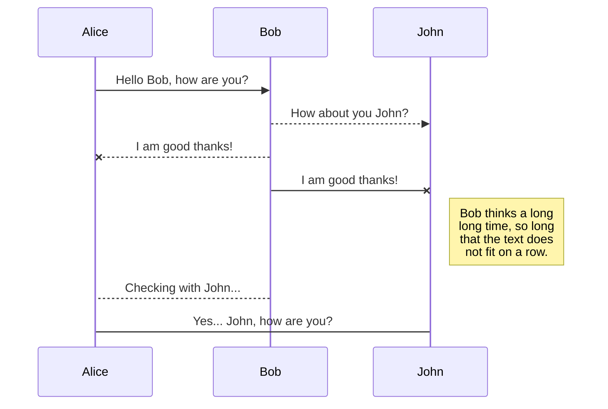
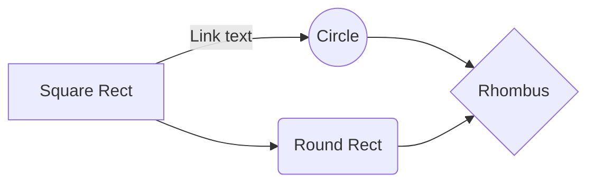

# Crie um blog com o Laravel 5.8!

Para criar o blog iremos utilizar o Laravel 5.8, para utilizar ele é necessário ter o composer instalado no computador.
[Download composer](https://getcomposer.org/)


## Instalando o laravel
Primeiro instale o laravel.
```php
composer global require laravel/installer
```
Quando o composer terminar de baixar as dependências do laravel, rode o seguinte comando para criar um novo projeto laravel
```php
composer create-project --prefer-dist laravel/laravel blog
```
Agora, acesse a pasta do seu projeto e coloque seu projeto online.
```php
cd blog
php artisan serve
```
Acesse o link que apareceu no seu terminal [http://127.0.0.1:8000](http://127.0.0.1:8000/)

Se tudo deu certo, ao acessar o link aparecera uma tela de boas vindas do Laravel


Caso não tenha aparecido esta tela, provavelmente você está sem algum dos requisitos para rodar o laravel, verifique os requisitos na [documentação do Laravel](https://laravel.com/docs/5.8#server-requirements).


## Configurações inicias do laravel

Se você instalou o laravel utilizando o composer como demonstrado neste tutorial, você já tem um arquivo chamado .env dentro da pasta do seu projeto laravel.  Abra o arquivo .env e verifique se a chave de aplicação foi criada, a chave será algo deste tipo

    APP_KEY=base64:wGMZl4gRjMzoboMCMbxyYOHUTg2rqrdTKU666hrpMJg=

Caso você não tenha o arquivo .env, crie uma cópia do arquivo .env.example e renomeie para .env
Agora para gerar a chave de aplicação, rode o seguinte comando
`php artisan key:generate`
## Configurando o banco de dados do blog

Neste tutorial iremos usar o [MySQL](https://www.mysql.com/) como SGBD, para dizer ao laravel qual é o nosso banco de dados, acesse o arquivo .env e procure pelas seguintes linhas
```
DB_CONNECTION=mysql       <- Defina a conexao como "mysql"
DB_HOST=127.0.0.1         <- Coloque o IP do seu banco de dados
DB_PORT=3306  	          <- A porta que o BD está utilizando
DB_DATABASE=homestead     <- O nome do seu banco de dados
DB_USERNAME=homestead     <- O usuário com acesso ao BD
DB_PASSWORD=secret        <- A senha do usuário
```

## Usuários
O laravel tem um sistema de autenticação de usuários pronto já, para utilizar basta rodar o comando
```php
php artisan make:auth
```
Após isso, uma série de arquivos foi modificado ou criado pelo laravel, para entender melhor o que aconteceu, veja na [documentação](https://laravel.com/docs/5.8/authentication#authentication-quickstart) as alterações feitas pelo comando.

## Criando as tabelas no banco de dados
O laravel usa o sistema de [migrations](https://laravel.com/docs/5.8/migrations) para criar um controle de versão do banco de dados. Acesse os migrations criados pelo "comando artisan make:auth" para ver a estrutura de um migration. Os migrations ficam em: **blog/database/migrations**

*O laravel contém uma grande quantidade de arquivos e pastas, para não perder tempo procurando cada vez que for modificar algum arquivo diferente, procure qual o atalho para navegar entre arquivos na IDE que estiver utilizando.
Caso esteja usando o [PHPStorm](https://www.jetbrains.com/phpstorm/), o atalho para navegar entre os arquivos é **CTRL+SHIFT+N**.*

Agora vamos criar a primeira tabela do banco de dados, a tabela Post. Rode o seguinte comando:
```php
php artisan make:model Post -rm
```
Com este comando vai ser criado o Modelo Post, a migration para criar a tabela Post e um controlador, vamos ver o que significa cada um destes itens ao longo do tutorial.
Para entender o comando você pode rodar "php artisan make:model -help", irá aparecer uma lista de opções que você pode utilizar junto com o comando, neste caso utilizamos -r para criar o controlador com a estrutura de Resource, e -m para criar o migration do modelo Post.

Acesse o arquivo da migration post, ele está em **blog/database/migrations/ 0000_00_00_0000_create_posts_table.php**
Agora vamos adicionar os elementos que um post tem, seu código deverá ficar parecido com isto:
``` php
<?php

use Illuminate\Support\Facades\Schema;
use Illuminate\Database\Schema\Blueprint;
use Illuminate\Database\Migrations\Migration;

class CreatePostsTable extends Migration
{
    
    public function up()
    {
        Schema::create('posts', function (Blueprint $table) {
            $table->bigIncrements('id');
            $table->timestamps();
            $table->string('title');
            $table->text('description');

            $table->unsignedBigInteger('user_id')->index();
            $table->foreign('user_id')->references('id')->on('users');

            $table->string('slug')->unique()->nullable();
            $table->mediumText('post_body');

            $table->string('image')->nullable();
        });
    }

    public function down()
    {
        Schema::dropIfExists('posts');
    }
}
```
Se você analisou o código, viu que foi criado uma relação entre Posts e Usuários pela chave estrangeira "user_id". Vamos definir isso nos nossos modelos "Post" e "Usuário"

Adicione o seguinte trecho de código no modelo Post, ele está localizado em **blog/app/Post.php**

```php
    public function user(){
        return $this->belongsTo(User::class);
    }
```

E o seguinte trecho de código no modelo User, localizado em **blog/app/User.php**
```php 
    public function posts(){
        return $this->hasMany(Post::class);
    }
```

Agora vamos criar o migration dos comentários, rode o comando
```php
php artisan make:model Comment -m
```
Adicione os atributos do comentário no migration **create_comments_table**
```php
<?php

use Illuminate\Support\Facades\Schema;
use Illuminate\Database\Schema\Blueprint;
use Illuminate\Database\Migrations\Migration;

class CreateCommentsTable extends Migration
{
    public function up()
    {
        Schema::create('comments', function (Blueprint $table) {
            $table->bigIncrements('id');
            $table->timestamps();
            $table->unsignedBigInteger('post_id');
            $table->unsignedBigInteger('user_id');
            $table->foreign('user_id')->references('id')->on('users')->onDelete("cascade");
            $table->foreign('post_id')->references('id')->on('posts')->onDelete("cascade");
            $table->text("comment");
        });
    }
    
    public function down()
    {
        Schema::dropIfExists('comments');
    }
}
```

Criando a migration para categorias

```php
php artisan make:model Category -m
```

Adicione o seguinte trecho de código a função **create** da migration **create_categories_table** 
```php
    $table->string('name');
```

## Delete a file

You can delete the current file by clicking the **Remove** button in the file explorer. The file will be moved into the **Trash** folder and automatically deleted after 7 days of inactivity.

## Export a file

You can export the current file by clicking **Export to disk** in the menu. You can choose to export the file as plain Markdown, as HTML using a Handlebars template or as a PDF.

# Synchronization

Synchronization is one of the biggest features of StackEdit. It enables you to synchronize any file in your workspace with other files stored in your **Google Drive**, your **Dropbox** and your **GitHub** accounts. This allows you to keep writing on other devices, collaborate with people you share the file with, integrate easily into your workflow... The synchronization mechanism takes place every minute in the background, downloading, merging, and uploading file modifications.

There are two types of synchronization and they can complement each other:

- The workspace synchronization will sync all your files, folders and settings automatically. This will allow you to fetch your workspace on any other device.
	> To start syncing your workspace, just sign in with Google in the menu.

- The file synchronization will keep one file of the workspace synced with one or multiple files in **Google Drive**, **Dropbox** or **GitHub**.
	> Before starting to sync files, you must link an account in the **Synchronize** sub-menu.

## Open a file

You can open a file from **Google Drive**, **Dropbox** or **GitHub** by opening the **Synchronize** sub-menu and clicking **Open from**. Once opened in the workspace, any modification in the file will be automatically synced.

## Save a file

You can save any file of the workspace to **Google Drive**, **Dropbox** or **GitHub** by opening the **Synchronize** sub-menu and clicking **Save on**. Even if a file in the workspace is already synced, you can save it to another location. StackEdit can sync one file with multiple locations and accounts.

## Synchronize a file

Once your file is linked to a synchronized location, StackEdit will periodically synchronize it by downloading/uploading any modification. A merge will be performed if necessary and conflicts will be resolved.

If you just have modified your file and you want to force syncing, click the **Synchronize now** button in the navigation bar.

> **Note:** The **Synchronize now** button is disabled if you have no file to synchronize.

## Manage file synchronization

Since one file can be synced with multiple locations, you can list and manage synchronized locations by clicking **File synchronization** in the **Synchronize** sub-menu. This allows you to list and remove synchronized locations that are linked to your file.


# Publication

Publishing in StackEdit makes it simple for you to publish online your files. Once you're happy with a file, you can publish it to different hosting platforms like **Blogger**, **Dropbox**, **Gist**, **GitHub**, **Google Drive**, **WordPress** and **Zendesk**. With [Handlebars templates](http://handlebarsjs.com/), you have full control over what you export.

> Before starting to publish, you must link an account in the **Publish** sub-menu.

## Publish a File

You can publish your file by opening the **Publish** sub-menu and by clicking **Publish to**. For some locations, you can choose between the following formats:

- Markdown: publish the Markdown text on a website that can interpret it (**GitHub** for instance),
- HTML: publish the file converted to HTML via a Handlebars template (on a blog for example).

## Update a publication

After publishing, StackEdit keeps your file linked to that publication which makes it easy for you to re-publish it. Once you have modified your file and you want to update your publication, click on the **Publish now** button in the navigation bar.

> **Note:** The **Publish now** button is disabled if your file has not been published yet.

## Manage file publication

Since one file can be published to multiple locations, you can list and manage publish locations by clicking **File publication** in the **Publish** sub-menu. This allows you to list and remove publication locations that are linked to your file.


# Markdown extensions

StackEdit extends the standard Markdown syntax by adding extra **Markdown extensions**, providing you with some nice features.

> **ProTip:** You can disable any **Markdown extension** in the **File properties** dialog.


## SmartyPants

SmartyPants converts ASCII punctuation characters into "smart" typographic punctuation HTML entities. For example:

|                |ASCII                          |HTML                         |
|----------------|-------------------------------|-----------------------------|
|Single backticks|`'Isn't this fun?'`            |'Isn't this fun?'            |
|Quotes          |`"Isn't this fun?"`            |"Isn't this fun?"            |
|Dashes          |`-- is en-dash, --- is em-dash`|-- is en-dash, --- is em-dash|


## KaTeX

You can render LaTeX mathematical expressions using [KaTeX](https://khan.github.io/KaTeX/):

The *Gamma function* satisfying $\Gamma(n) = (n-1)!\quad\forall n\in\mathbb N$ is via the Euler integral

$$
\Gamma(z) = \int_0^\infty t^{z-1}e^{-t}dt\,.
$$

> You can find more information about **LaTeX** mathematical expressions [here](http://meta.math.stackexchange.com/questions/5020/mathjax-basic-tutorial-and-quick-reference).


## UML diagrams

You can render UML diagrams using [Mermaid](https://mermaidjs.github.io/). For example, this will produce a sequence diagram:



And this will produce a flow chart:

